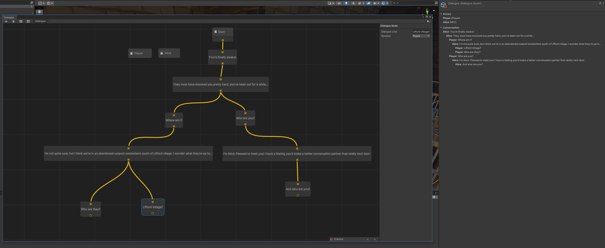

# Dialogue System for Unity

This is a work in progress Dialogue authoring tool I'm making to use in my game.

Please note this isn't ready and doesn't include any runtime logic yet. All it does is help the user author a simple asset with actors and a conversation.

# Usage

## Authoring

### Creating a new dialogue

In the project window, right mouse click to open the asset creation menu and select: Create > Game Data > Dialogue.

Open the newly created Dialogue asset (double click).

### Creating an actor

An actor is someone who speaks in the dialogue. To create one, with the dialogue editor open:

1. Press space (or Right Mouse Click: Create Node)
2. Select Actor. Double click the newly created Actor to rename it.
3. With the actor selected, on the right hand side Node Inspector you can select if the actor is a player or an NPC.

### Creating a dialogue line

1. Press space (or Right Mouse Click: Create Node)
2. Select Dialogue Node.
3. Double click the center of the dialogue node to edit the text. (Node visuals will be improved in the future)
4. With the dialogue node selected, you can choose the speaker in the node inspector.

### Creating a conversation

Node connection is done by dragging holding the mouse on an output port (the yellow box at the bottom of a node) and dragging it onto another node's input port. This should create a yellow connection line.

1. Connect the first node to the Start Node (should be automatically in the graph when first created).
2. Create subsequent nodes and connect them to previous node.
3. ...
4. Profit!

### Inspecting the runtime asset

When a dialogue is authored, a more optimised runtime asset (DialogueAsset.cs) is created as a child of the main asset. Expand the main asset and select the child asset to see it in the default Unity inspector.

## Runtime

Not implemented yet.